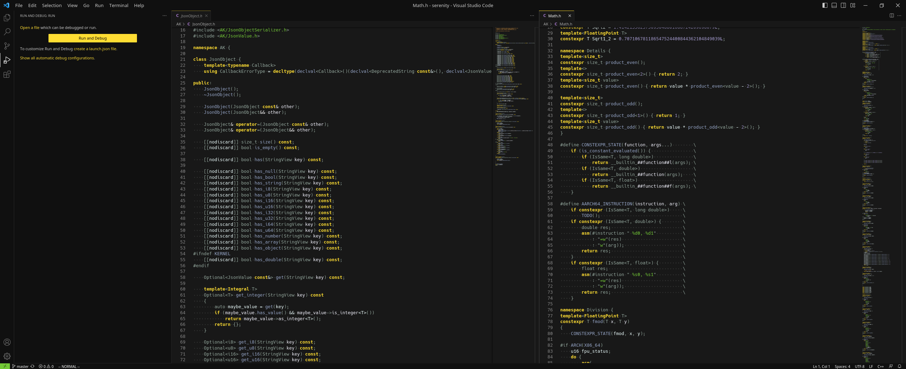

# Gruber Darker theme for Visual Studio Code

[Ported from Emacs](https://github.com/rexim/gruber-darker-theme), by rexim and Jason Blevins.  
Mostly for my use when I actually have to use this editor (tho Dark Modern is also nice)

I am probably not going to publish this on VSCode Extensions.

# Install

Requirements:
- NodeJS and NPM 
- Visual Studio Code
- `vsce` package from `npm`

```sh
$ git clone https://github.com/cocateh/code-gruber-darker
$ cd code-gruber-darker
$ vsce package
$ code --install-extension gruber-darker-(version).vsix
```

# Screenshots





